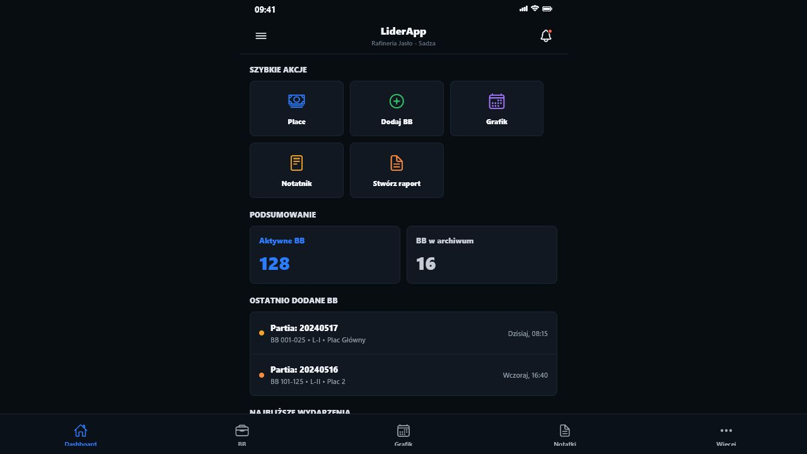
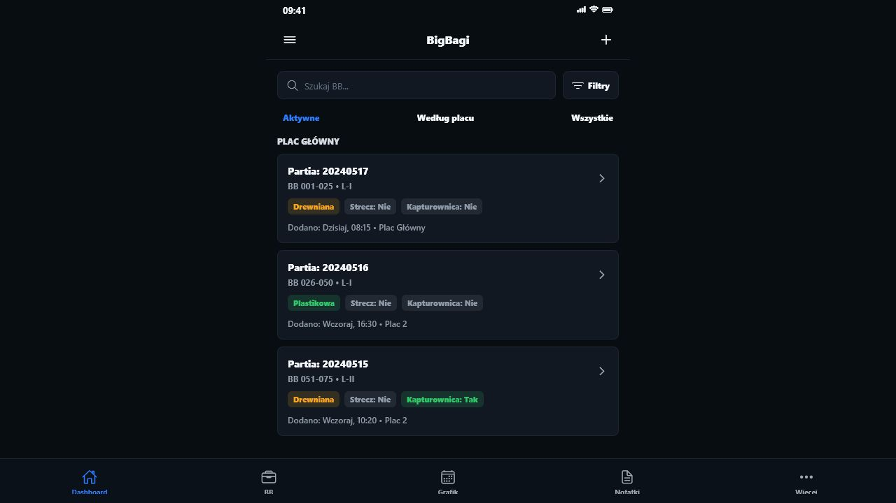
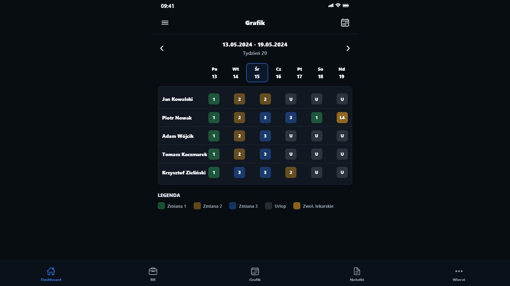
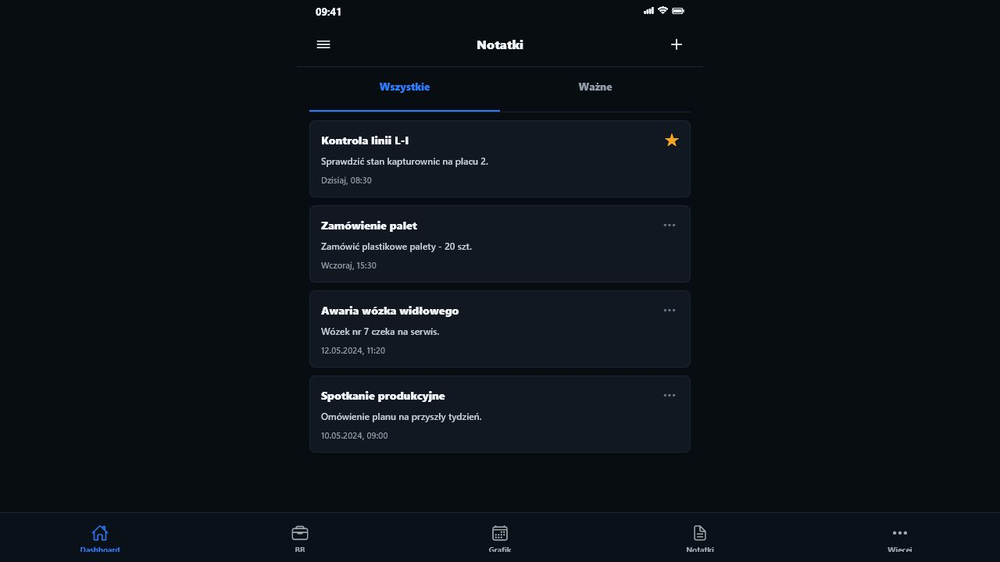
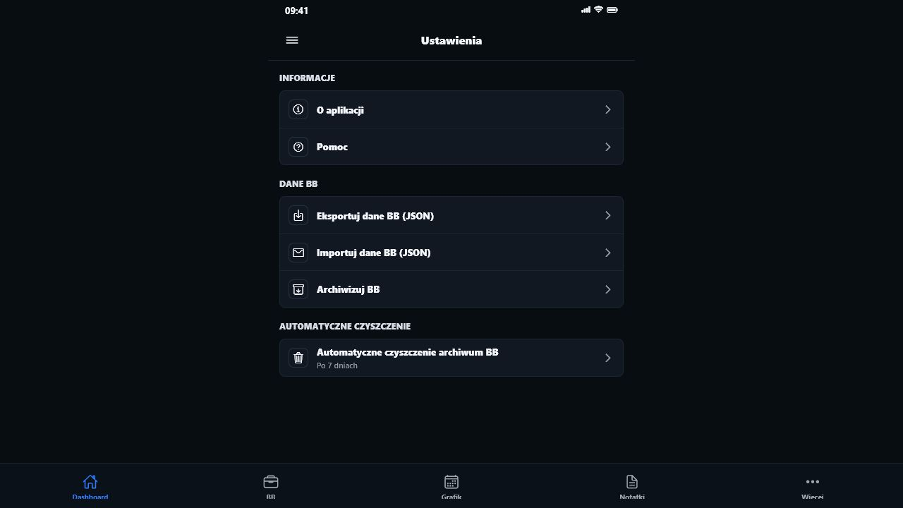

# Dokumentacja projektu LiderApp

## 1. Opis koncepcji programu - lista wymagan

LiderApp jest aplikacja mobilna wspierajaca codzienna prace lidera zmianowego. Program laczy w jednym miejscu ewidencje partii BB, place skladowania, grafiki pracy, kalendarz, notatki oraz raporty zmianowe. Aplikacja jest przygotowana do pracy offline, a dane sa zapisywane lokalnie na urzadzeniu w bazie SQLite.

### Wymagania funkcjonalne

- Aplikacja powinna umozliwiac szybki podglad najwazniejszych informacji na ekranie glownym.
- Uzytkownik powinien miec mozliwosc dodawania, wyszukiwania, filtrowania i archiwizowania rekordow BB.
- System powinien obslugiwac place skladowania oraz powiazanie BB z konkretnym placem.
- Program powinien wykrywac duplikaty i nachodzace zakresy BB dla tej samej partii.
- Aplikacja powinna pozwalac na podzial zakresu BB na dwie czesci.
- Uzytkownik powinien miec mozliwosc importu i eksportu danych BB w formacie JSON.
- Aplikacja powinna umozliwiac dodawanie BB ze zdjecia z wykorzystaniem lokalnego OCR, z recznym potwierdzeniem danych przed zapisem.
- Program powinien obslugiwac tworzenie grafikow pracy dla pracownikow.
- Grafik powinien pozwalac na przypisywanie typow zmian, urlopu, L4 i dni wolnych.
- Program powinien obliczac godziny pracy na podstawie wybranych zmian.
- Grafik powinien miec mozliwosc eksportu do pliku Excel.
- Uzytkownik powinien moc tworzyc notatki, oznaczac je jako wazne, wyszukiwac, edytowac i usuwac.
- Kalendarz powinien pozwalac na dodawanie wydarzen roznych typow oraz prezentowac widok miesieczny i liste wydarzen.
- Raporty powinny umozliwiac tworzenie wpisow zmianowych recznie albo z tekstu odczytanego przez OCR.
- Aplikacja powinna miec sekcje ustawien z dostepem do archiwum, importu/eksportu i parametrow automatycznego czyszczenia danych.

### Wymagania niefunkcjonalne

- Aplikacja powinna dzialac lokalnie, bez koniecznosci stalego polaczenia z internetem.
- Dane powinny byc przechowywane w lokalnej bazie SQLite.
- Interfejs powinien byc prosty, czytelny i dostosowany do obslugi na telefonie.
- Nawigacja powinna byc oparta o dolne zakladki i dodatkowe menu sekcji.
- Aplikacja powinna wykorzystywac walidacje danych przed zapisem.
- Operacje usuwania i archiwizacji powinny wymagac potwierdzenia tam, gdzie istnieje ryzyko utraty danych.

## 2. Opis technologii wykonania

Projekt zostal wykonany jako aplikacja Expo/React Native z uzyciem TypeScript. Aplikacja korzysta z routingu plikowego Expo Router, lokalnej bazy danych SQLite oraz natywnych modulow Expo do pracy z aparatem, plikami i udostepnianiem.

### Glowne technologie

- **React 19.1.0** - biblioteka do budowy interfejsu uzytkownika.
- **React Native 0.81.5** - technologia pozwalajaca tworzyc aplikacje mobilne z komponentow React.
- **Expo 54** - platforma upraszczajaca budowe, uruchamianie i konfiguracje aplikacji React Native.
- **Expo Router 6** - routing plikowy, w ktorym struktura katalogu `app` odpowiada trasom aplikacji.
- **TypeScript 5.9** - statyczne typowanie kodu, typy modeli danych i lepsza kontrola bledow.
- **SQLite przez `expo-sqlite`** - lokalna baza danych dla modulow BB, grafikow, notatek, kalendarza i raportow.

### Wybrane biblioteki projektu

- `@expo/vector-icons` - ikony w interfejsie.
- `@react-navigation/bottom-tabs` i `@react-navigation/native` - nawigacja zakladkowa i integracja z React Navigation.
- `expo-camera` - wykonanie zdjecia etykiety lub dokumentu przed OCR.
- `@react-native-ml-kit/text-recognition` - lokalne rozpoznawanie tekstu ze zdjec.
- `expo-document-picker` - wybor pliku przy imporcie danych.
- `expo-file-system` - zapis i odczyt plikow lokalnych.
- `expo-sharing` - udostepnianie wygenerowanych plikow.
- `expo-clipboard` - praca ze schowkiem.
- `react-native-reanimated`, `react-native-gesture-handler`, `react-native-screens` - natywne wsparcie animacji, gestow i ekranow.

## 3. Opis implementacji

Kod aplikacji jest podzielony wedlug funkcji biznesowych. Gorna warstwa routingu znajduje sie w katalogu `app`, wspolne komponenty w `components`, a logika poszczegolnych modulow w `src/features`.

### Struktura katalogow

- `app` - definicje tras i ekranow Expo Router. Zawiera m.in. zakladki, ekrany szczegolow, formularze tworzenia i edycji.
- `app/(tabs)` - glowne zakladki aplikacji: dashboard, BB, grafik, notatki, raporty i ustawienia.
- `components` - komponenty wspolne dla calej aplikacji, np. ekran aplikacji, karty, przyciski ikonowe i teksty tematyczne.
- `constants` - stale aplikacji, np. konfiguracja motywu.
- `hooks` - wspolne hooki React Native, np. obsluga schematu kolorow.
- `src/features` - glowne moduly biznesowe aplikacji.
- `assets/images` - ikony, grafiki splash screen i favicon.
- `dist-test` - statyczny build testowy uzyty do podgladu ekranow.

### Warstwa wspolna interfejsu

Plik `components/lider-ui.tsx` zawiera wspolne elementy UI:

- `AppScreen` - glowny szablon ekranu z naglowkiem, ikonami, obsluga menu i powiadomien.
- `Card` - kontener dla grup danych.
- `SectionTitle` - naglowek sekcji.
- `IconButton` - przycisk ikonowy.
- `Pill` - etykieta statusu lub kategorii.
- `liderColors` - paleta kolorow aplikacji.

### Modul BB

Modul znajduje sie w `src/features/bb`. Odpowiada za ewidencje rekordow BB, place, archiwum, import/eksport oraz OCR.

- `screens` - ekrany listy BB, dodawania, edycji, szczegolow, archiwum, importu/eksportu i dodawania ze zdjecia.
- `components` - formularze, karty BB, filtry, ostrzezenia o duplikatach, okno podzialu BB i podglad OCR.
- `services` - logika biznesowa, archiwizacja, kopie zapasowe, podzial zakresow i OCR.
- `yards` - osobny podmodul placow skladowania.
- `database/migrations` - tworzenie i aktualizacja tabel SQLite.
- `validation` - sprawdzanie poprawnosci danych przed zapisem.
- `utils` - formatowanie i obsluga zakresow BB.

Najwazniejsze dane sa przechowywane w tabelach `bb_records`, `yards` i `app_settings`. Rekord BB posiada m.in. numer partii, rodzaj sadzy, zakres BB, linie, plac oraz informacje o statusie.

### Modul Grafik

Modul znajduje sie w `src/features/schedule`. Odpowiada za pracownikow i harmonogram zmian.

- `screens` - lista grafikow, edytor grafiku, lista pracownikow i edycja pracownika.
- `components` - tabela grafiku, komorki zmian, pasek narzedzi, legenda, formularz pracownika i wybor zmiany.
- `services` - tworzenie grafiku, obsluga pracownikow, eksport i automatyczne czyszczenie starych grafikow.
- `repositories` - dostep do tabel SQLite.
- `validation` - walidacja pracownikow i zakresow dat.
- `utils` - pomocnicze funkcje dat i zmian.

Grafik zapisuje wpisy po konkretnej dacie (`entryDate`) i pracowniku, co pozwala pozniej liczyc obsade oraz godziny pracy bez zgadywania na podstawie numeru tygodnia.

### Modul Notatki

Modul znajduje sie w `src/features/notes`. Odpowiada za lokalny notatnik.

- `screens` - lista notatek, szczegoly notatki i edycja.
- `components` - karta notatki, formularz i zakladki filtrowania.
- `services` i `repository` - logika zapisu, odczytu, edycji i usuwania.
- `validation` - blokada pustych notatek.
- `database/migrations` - tabela `notes` oraz indeksy przyspieszajace sortowanie i filtrowanie.

Notatki moga byc oznaczane jako wazne, filtrowane i wyszukiwane po tytule oraz tresci.

### Modul Kalendarz

Modul znajduje sie w `src/features/calendar`. Obsluguje wydarzenia i przypomnienia.

- `screens` - widok miesieczny, lista wydarzen, szczegoly i edycja.
- `components` - komorka dnia, widok miesiaca, karta wydarzenia, formularz i wybor typu wydarzenia.
- `services` i `repository` - zapis i odczyt wydarzen.
- `utils` - formatowanie dat i obliczenia kalendarzowe.
- `validation` - sprawdzanie tytulu, daty i typu wydarzenia.

Wydarzenia maja typy takie jak praca, grafik, raport, BB, urlop, spotkanie, przypomnienie i inne. Dashboard wykorzystuje kalendarz do pokazania najblizszych terminow oraz powiadomien.

### Modul Raporty

Modul znajduje sie w `src/features/reports`. Odpowiada za raporty zmianowe.

- `database/migrations/reportMigration.ts` - tworzy tabele raportow i wpisow raportow.
- `services/reportRepository.ts` - zapis, odczyt, edycja i usuwanie raportow.
- `services/reportOcrParser.ts` - przetwarzanie tekstu OCR do postaci wpisow raportu.
- `services/reportFormatter.ts` - formatowanie raportu do czytelnej tresci.
- `types/reportTypes.ts` - typy danych raportow.

Raporty przechowuja tytul, tresc, liczbe wpisow oraz daty utworzenia i aktualizacji.

## 4. Opis warstwy uzytkowej z widokami ekranu

Interfejs aplikacji jest zaprojektowany jako aplikacja mobilna. Ekrany maja ciemny motyw, gorny pasek z tytulem, ikony akcji oraz dolna nawigacje zakladkowa. Dodatkowe sekcje sa dostepne z menu.

### Dashboard

Dashboard jest ekranem startowym. Pokazuje szybkie akcje, podsumowanie aktywnych i archiwalnych BB, ostatnio dodane rekordy oraz najblizsze wydarzenia z kalendarza.

### BB

Widok BB sluzy do pracy z rekordami partii. Uzytkownik moze wyszukiwac BB, wlaczac filtry, przegladac rekordy wedlug placu i przechodzic do szczegolow. Karty pokazuje numer partii, zakres BB, linie, etykiety statusu oraz plac.

### Grafik

Widok grafiku prezentuje harmonogram zmian w ukladzie tabelarycznym. Wiersze odpowiadaja pracownikom, kolumny dniom, a komorki zawieraja typ zmiany. Ekran ma pasek wyboru zakresu dat oraz akcje zwiazane z edycja grafiku.

### Notatki

Notatnik zawiera liste notatek z filtrem wszystkich i waznych wpisow. Karta notatki pokazuje tytul, fragment tresci, date oraz oznaczenie waznosci.

### Ustawienia

Ustawienia grupuja informacje o aplikacji, pomoc, import i eksport danych BB, archiwum oraz parametry automatycznego czyszczenia archiwum i grafikow.

## 6. Materialy zrodlowe

- Kod zrodlowy projektu LiderApp: katalog `C:\Users\Vic\Desktop\LA1\LiderApp`.
- Konfiguracja zaleznosci: `package.json`.
- Konfiguracja Expo: `app.json`.
- Opis modulow projektu: `README.md`.
- Dokumentacja Expo: https://docs.expo.dev/
- Dokumentacja Expo Router: https://docs.expo.dev/router/introduction/
- Dokumentacja React Native: https://reactnative.dev/docs/getting-started
- Dokumentacja SQLite w Expo: https://docs.expo.dev/versions/latest/sdk/sqlite/
- Dokumentacja Expo Camera: https://docs.expo.dev/versions/latest/sdk/camera/
- Dokumentacja React Navigation: https://reactnavigation.org/docs/getting-started
- Dokumentacja TypeScript: https://www.typescriptlang.org/docs/
